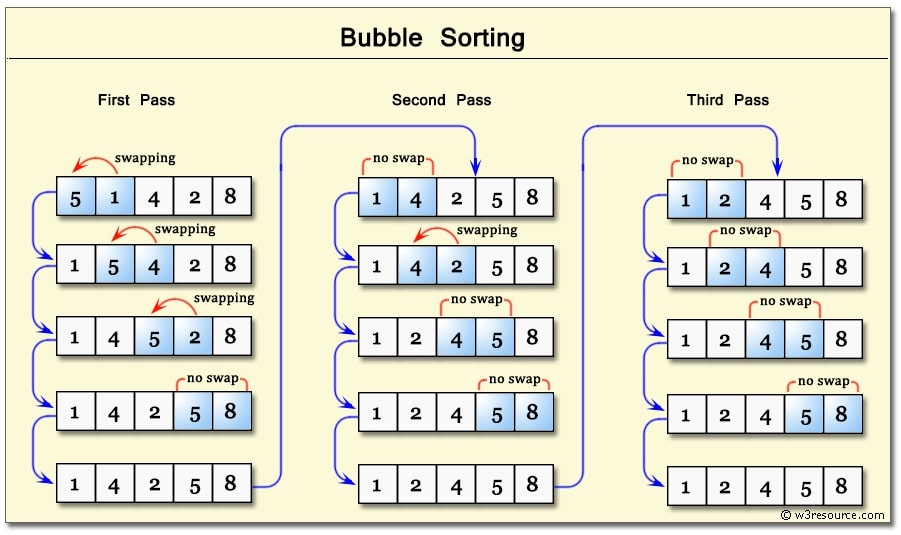
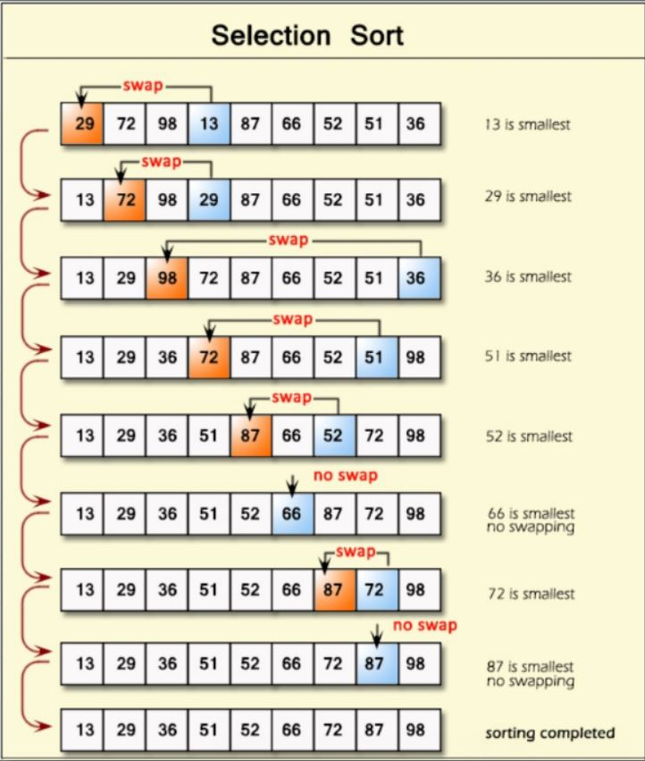
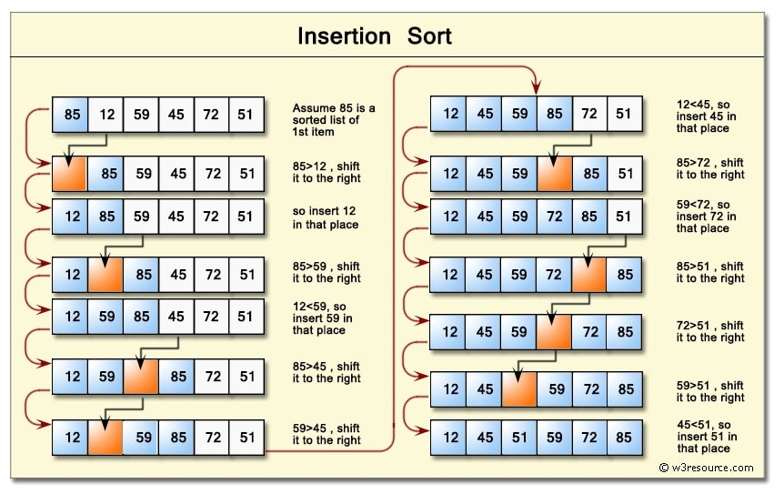

# Sorting

### Introduction

This project goes over various sorting algorithms.  Although many languages have built-in 
sorting methods, it is important to learn how to do this yourself, either to implement 
a more efficient algorithm within a case or to sort in a custom fashion.  These algorithms 
are explained in greater detail in their individual sections.

* Bubble sort
* Selection sort
* Insertion sort

Depending on the approach of the sorting algorithm, the elements can be arranged in ascending
or descending order, or any other way the programmer wishes to implement (for example, 
sorting by item frequency).

Commonly introduced together with sorting, we will also discuss time and space complexity.

---
### Complexity
All computer operations take time and resources.  This includes the computer cycles 
necessary to process and run the program, together with the amount of space the program 
requires because of its generated contents.  Complexity is often stated in Big-O notation 
pronounced "big-oh"), which signifies the upper bound of the cost for the program.  There 
are other notations (i.e. for lower bound and average), but we will not discuss that here.

Generally, the main focus is on time complexity.  This does not necessarily mean the 
actual time it will take for the program to run, but the expected computations the 
computer will be required to run to complete the program.

The other complexity is space complexity, which is often less important, and discussed 
less.  It refers to how much space the  program will take up.  Again, this is not 
necessarily the actual physical space, but  rather an estimate based on the figures 
and processes in the program.

Notation is often given in general terms, and is rounded to some common terms.  Some 
terms are:
- O(1) - constant complexity.
  - Time: the program will run in a linear progression, without loops.  Whether the code 
  is 5 lines of print statements or 10 lines does not matter; both are O(1).
  - Space: the program uses a constant amount of space.  The only times this is increased 
  is when multiple structures are generated, usually though loops.  All sorts discussed 
  in this assignment will maintain a space of O(1), since they do not generate additional 
  arrays when sorting.
- O(n) - linear complexity.
  - Time: the program must iterate through an array.  Occasionally, if the program 
  iterates through an array twice, you may find it being written as O(2n), but that is 
  generally only in places where they must be extremely careful about efficiency.  
  Generally, such a case would still be written as O(n).
  - Space: this occurs when the program generates auxiliary elements when working through 
  the problem.
- O(n2) - quadratic complexity.
  - Time: the program must run through a double loop.  For example, some methods for 
  sorting an array of length *n* requires it to iterate over itself multiple times.  This 
  complexity is O(n x n), or O(n2).
  - Space: this need not be discussed here - to achieve such space complexity, it must 
  generate a massive amount of data when running.

To read more about complexity, see the links at the bottom.

---
### Bubble sort

Bubble sort (also known as sinking sort) is perhaps the easiest of the sorting algorithms.
  It repeatedly compares two adjacent elements and swaps them if they are in the wrong 
order.  It can be visualized as a queue where people arrange themselves by swapping with 
each other so that they all can stand in ascending order of their heights.  In other words, 
we compare two adjacent elements and see if their order is wrong; and if so, we swap them.
  We then move forward one, comparing the current latter element of the pair with the next 
element in the list.

For an array of length *n*, it will generally make *n* passes, for a total of *n* x *n* 
calculations.  This is done using a nested loop.  This results in a space complexity of 
O(1), but has a time complexity of O(n2) in best, average, and worst cases due 
to the nested loop.

The sort can be optimized by including a sentinel to watch if any swapping action has 
occurred.  After all elements have "bubbled" to the correct place, it will run through 
the array again, and when it reaches the end without swapping any elements, it will 
terminate any further iterations of the loop.  This sentinel will always be watching - 
if the enhanced bubble sort is run on an already-sorted list, it will complete its first 
run and stop iterations.  This optimized algorithm has a worst and average-case time 
complexity of O(n2), and a best-case time complexity of O(n) (since it must run 
through the array at least once).

 

---
### Selection sort

Selection sort repeatedly finds the minimum element (or maximum, if the algorithm is 
performing a descending sort) and sorts it in order.  The sort does not create a second 
array, but rather maintains two subarrays during execution of the algorithm.  One subarray 
is already sorted (the first part of the array), while the remaining subarray (the rest 
of the array) is unsorted.  During each iteration of the selection sort, the minimum 
element of the unsorted array is arranged into the sorted array.  There are two methods 
of inserting the lowest element into the correct slot:
1. The element to be moved is removed from the unsorted subarray and inserted at the end 
of the sorted subarray.  All elements between the insertion point and removal point must 
be shifted up by one.  This method can be extremely expensive.  Depending on how the array 
is implemented in the backend, if the lowest number is in the last slot of an array of 
length *n*, it will require *n* element transfers (all other elements must be moved up one 
slot) to insert the lowest number into the first slot.
2. The more efficient method (and generally the method applied) is to swap the element at 
front of the unsorted subarray with the lowest element.  This involves storing one element
(for example, the minimum value) in a temporary variable, shifting the element at the head
(front) of the unsorted subarray to the space previously occupied by the minimum value, and
then moving the temporary value to the head of the unsorted subarray.

Selection sort is a more efficient algorithm than bubble sort.  It has a space complexity 
of O(1), and has a best, worst, and average-case time complexity of O(n2).  While 
this may seem equal to that of bubble sort, it is more efficient due to two factors:
1. In bubble sort, to shift an element to its correct place can cost many cycles of 
rewrites.  To shift an element 4 spaces requires 4 cycles of rewrites.  Selection, on the 
other hand, accomplishes this in 1 cycle.
2. Bubble sort considers the entire array unsorted until its completion.  This is what gives 
it the time complexity of O(n2).  It will always look over the entire array, 
even if only one element needs to be shifted.  Selection sort maintains two subarrays, 
the sorted subarray at the beginning and the unsorted subarray at the end.  This allows 
selection sort to skip over this subarray when checking for the next item - it knows this 
section is sorted and cannot contain the correct element.  Although you might think this 
would change its time complexity to below O(n2), it is not written as such.  
This is because complexities are given as approximations, following easily-recognizable 
mathematical functions.

Similar to bubble sort, this sort can be optimized by the inclusion of a sentinel that 
terminates the sorting algorithm if no elements are swapped in a pass.  This changes its 
best-case time complexity to O(n).

---
### Insertion sort

Insertion sort maintains two subarrays, similar to selection sort.  Values from the 
unsorted part of the array are placed into the correct position in the sorted part.  Unlike 
bubble and selection sort, however, this algorithm operates off of a single primary for 
loop, rather than the double for loop required by the previous sorts.  It iterates 
forward in the array, and when it comes to an unsorted number, it constantly swaps it 
backward - not unlike a bubble sort.  The while loop swaps it back until it determines 
the elements are in the correct order, and then it returns control to the primary for 
loop.

It is more efficient in practice than other algorithms such as the bubble and selection 
sort.  Insertion sort has a space complexity of O(1), a time complexity of O(n2) 
in the worst and average cases, and best-case complexity of O(n).

Insertion sort can be made slightly more efficient.  While bubble and selection can have 
a sentinel added to stop the double loop prematurely, this algorithm only uses one loop 
and must complete it.  Rather, the modification would be made to the method by which it 
determines the correct location for the element to be moved back.  However, since this 
makes use of a searching algorithm, we will not discuss it here.  The time complexity for 
insertion sort remains the same, although it can result in fewer computations.

---

### Assignment
All tasks are to be completed in `main.py`.
1. Create an ascending (lowest to hightest) bubble sort.  Before each larger iteration 
(the external loop), print the iteration number.  After each time an element is moved, 
print out the list.  Perform this operation on `number_array_1`, `number_array_2`, and 
`string_array`.
2. Create an ascending selection sort.  Just like in task 1, print out each iteration 
number and after each element movement.  Use the same arrays as for bubble sort.
3. Create a descending bubble sort.  Use the additional instructions from task 2.
4. Create an ascending insertion sort.  Use the additional instructions from task 2.
5. Using the `people_array` and any sorting method you wish:
   - sort them in ascending order by ID, then print the final result
   - sort them in ascending order by age, then print the final result
   - sort them in descending order by name, then print the final result

   Note: You can get a person's age by using `person.age`, and `Person` has a `str` function 
will print out all the information if you call `print` on the whole class.

---
### Resources
- `UnsortedArrays` - this class contains the arrays you are to perform the sorts on.
- `Person` - used by `UnsortedArrays` to create the people.  You will be interacting 
with this class to perform some sorts.

---
### Links
- [Space and Time Complexity in Computer Algorithms](https://towardsdatascience.com/space-and-time-complexity-in-computer-algorithms-a7fffe9e4683)
- [Wikipedia - Time Complexity](https://en.wikipedia.org/wiki/Time_complexity)